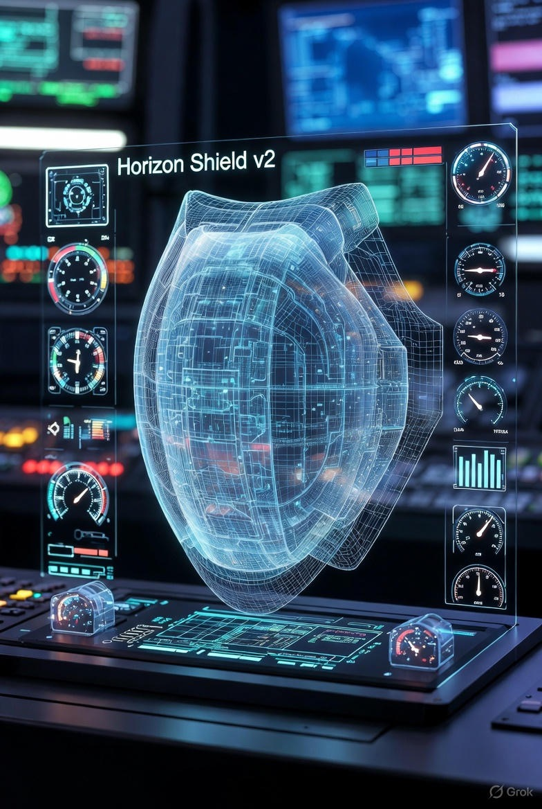
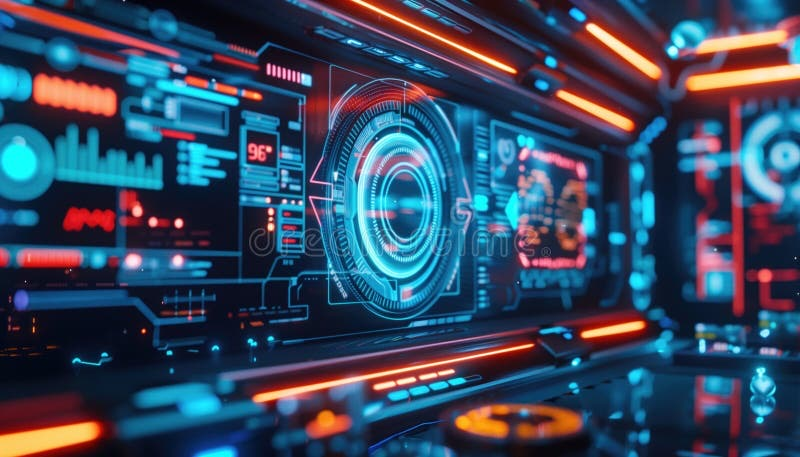
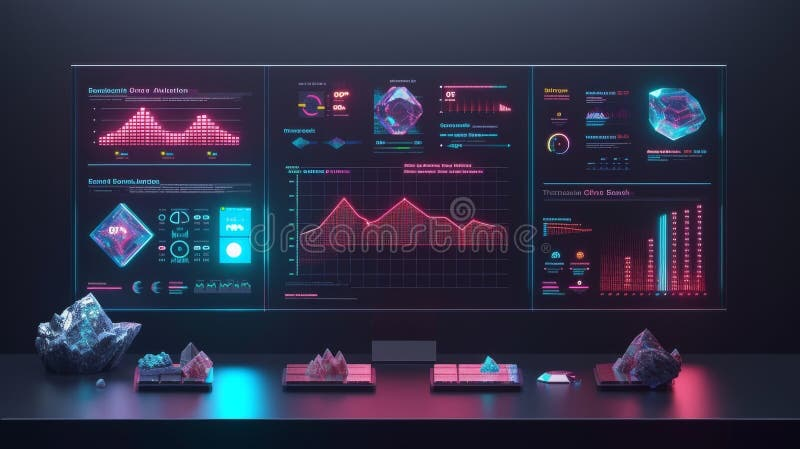

# Holographic Horizon Shield v2 🛡️🌌


*<p align="center">Horizon Shield v2 core activated — Massive glowing blue wireframe holographic sphere with real-time gauges, dials, and threat indicators monitoring the event horizon</p>*

**v2 of Holographic Horizon Shield: Advanced LLM defenses with Phi-3 integration and boundary scans**

The **Holographic Horizon Shield** draws inspiration from black hole physics and the holographic principle — encoding unbreakable defenses on the boundary of LLM inputs.

This evolving prototype features layered anomaly detection, QKD-inspired entropy monitoring, and on-device Phi-3 guard rails. All running locally for maximum privacy.

## Key Features

- **Holographic Boundary Scanner** → Token-level statistical anomaly detection
- **QKD-Inspired Entropy Layer** → Irreversible information flow checks
- **Phi-3 Guard** → Lightweight semantic safety scoring with Microsoft's Phi-3-mini
- **Real-Time Dashboard** → Interactive monitoring via `shield_v2_dashboard.py`
- **Modular Design** → Easy extension in `layers/` folder


*<p align="center">Core reactor pulsing at peak capacity — Neon orange/cyan waveforms and circular gauges during live boundary scans and adversarial simulations</p>*

## Shield Layers

Concentric defenses inspired by event horizons:

1. **Outer Horizon: Boundary Scanner**  
   Detects entropy spikes and unusual token distributions.

2. **Mid Layer: QKD Entropy Monitor**  
   Flags irreversible entropy shifts indicative of injections.

3. **Inner Core: Phi-3 Guard**  
   Semantic evaluation for jailbreak/harm potential.


*<p align="center">Advanced triple-screen analytics — Crystalline holographic projections, pink/red entropy heatmaps, and physical crystal artifacts tracking shield activations</p>*

## Quick Start

```bash
git clone https://github.com/jadeavsmith-tech/holographic-horizon-shield-v2.git
cd holographic-horizon-shield-v2

pip install -r requirements.txt

# Download Phi-3 model (one-time)
python -c "from huggingface_hub import snapshot_download; snapshot_download(repo_id='microsoft/Phi-3-mini-4k-instruct')"

# Run prototype
python shield_v2_prototype.py

# Launch interactive dashboard
streamlit run shield_v2_dashboard.py
